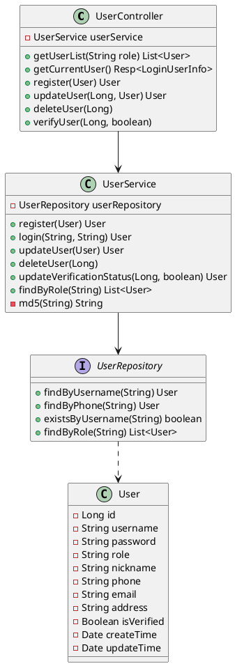
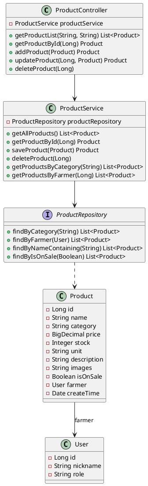
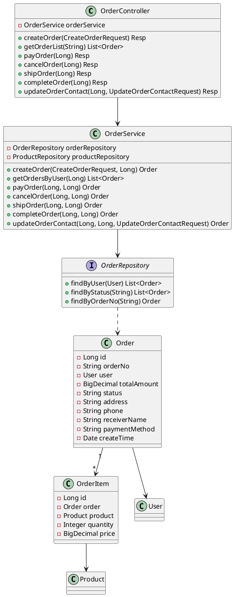

# 农产品电商系统类图设计

## 1. 用户管理模块

在用户管理模块的实现中，UserController 首先接收前端发送的用户相关请求，例如用户注册、登录验证、角色管理等，之后 UserController 根据请求类型，调用 UserService 中相应的方法。当收到用户注册请求时，UserService 调用 register 方法进行处理。UserService 封装了用户管理的核心业务逻辑，包括 MD5 密码加密、角色权限验证、农户认证状态管理等，如果涉及数据操作，UserService 会调用 UserRepository 中的方法。在保存用户信息时，会调用其中的插入方法将数据存入数据库，在验证登录时，会调用 findByUsername 方法查询用户数据并进行密码比对。UserRepository 继承 Spring Data JPA 的 Repository 接口，通过方法命名约定自动生成查询语句，无需手写 SQL。这种分层架构设计使得各层职责更加清晰明确，Controller 负责请求分发，Service 负责业务逻辑，Repository 负责数据访问。用户管理模块类图如图 X-X 所示。

---

## 2. 商品管理模块

在商品管理模块的实现中，ProductController 首先接收前端发送的商品相关请求，例如商品发布、商品查询、库存管理等，之后 ProductController 根据请求类型，调用 ProductService 中相应的方法。当收到农户发布商品的请求时，ProductService 调用 saveProduct 方法进行处理。ProductService 封装了商品管理的核心业务逻辑，包括商品信息验证、库存管理、上下架控制、农户权限验证等，如果涉及数据操作，ProductService 会调用 ProductRepository 中的方法。在保存商品信息时，会调用其中的插入方法将数据存入数据库，在查询商品列表时，会调用 findByCategory 或 findByFarmer 等方法获取相关数据。ProductRepository 继承 Spring Data JPA 的 Repository 接口，通过方法命名约定自动生成查询语句。Product 实体通过 @ManyToOne 注解与 User 实体建立关联关系，实现了农户与商品的多对一映射，确保每个商品都能追溯到发布的农户。这种分层架构设计使得各层职责更加清晰明确。商品管理模块类图如图 X-X 所示。

---

## 3. 订单管理模块

在订单管理模块的实现中，OrderController 首先接收前端发送的订单相关请求，例如创建订单、支付订单、查询订单状态等，之后 OrderController 根据请求类型，调用 OrderService 中相应的方法。当收到用户创建订单的请求时，OrderService 调用 createOrder 方法进行处理。OrderService 封装了订单管理的核心业务逻辑，包括订单状态流转控制、库存扣减、金额计算、权限验证等，如果涉及数据操作，OrderService 会调用 OrderRepository 中的方法。在保存订单信息时，会调用其中的插入方法将订单数据存入数据库，在查询订单列表时，会调用 findByUser 或 findByStatus 等方法获取相关数据。OrderRepository 继承 Spring Data JPA 的 Repository 接口，通过方法命名约定自动生成查询语句。Order 实体通过 @ManyToOne 注解与 User 实体建立关联关系，记录订单的购买用户，同时通过 @OneToMany 注解与 OrderItem 实体建立一对多关系，实现订单明细的管理。订单模块实现了完整的状态机流转（待支付→已支付→已发货→已完成/已取消），并新增了 updateOrderContact 方法，允许用户在未支付状态下修改收货地址和联系电话。这种分层架构设计使得各层职责更加清晰明确，确保了订单流程的安全性和一致性。订单管理模块类图如图 X-X 所示。

---

## 架构说明

三个模块均采用标准Spring Boot MVC三层架构：

1. **Controller层**：处理HTTP请求、Session管理、权限验证
2. **Service层**：封装业务逻辑、状态流转、数据验证
3. **Repository层**：继承JpaRepository，提供数据访问和自定义查询
4. **实体关联**：通过JPA注解(@ManyToOne/@OneToMany)建立实体关系，保证数据完整性

该架构职责清晰、易于维护和扩展。
