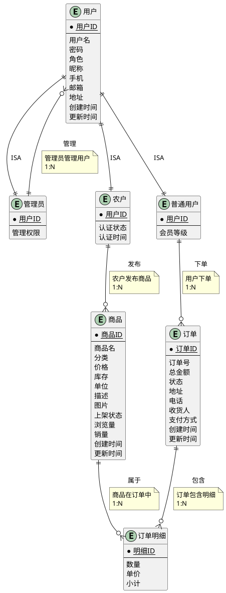

# 农产品电商系统ER图设计

## 系统概述

数据库有四个实体集。一是"用户"实体集，属性有用户ID、用户名、密码、角色、昵称、手机、邮箱、地址、认证状态等，用户按角色分为"管理员"、"农户"、"普通用户"三类；二是"商品"实体集，属性有商品ID、商品名、分类、价格、库存、单位、描述、图片、上架状态等；三是"订单"实体集，属性有订单ID、订单号、总金额、状态、地址、电话、收货人、支付方式等；四是"订单明细"实体集，属性有明细ID、数量、单价、小计等。

农户与商品之间存在"发布"联系，每个农户可发布多种商品，每种商品只能由一个农户发布；普通用户与订单之间存在"下单"联系，每个用户可下多个订单，每个订单只属于一个用户；订单与商品之间存在"包含"联系，每个订单可包含多种商品，每种商品可在多个订单中出现，订单包含商品有个数量属性。管理员负责用户管理、农户认证、订单监控等系统管理功能。

试画出反映上述问题的ER图，并将其转换成关系模型。

## ER图



## 传统ER图表示法

按照教科书风格的ER图：

```
                            用户名    密码    角色
                              |       |       |
                          +---+-------+-------+---+
                          |                       |
                        用户ID                  昵称
                          |                       |
                     +----+----+             +----+----+
                     |  用户   |             |  手机   |
                     +---------+             +---------+
                          |                       |
                        邮箱                    地址
                          |                       |
                      创建时间                更新时间
                          |
              +-----------+-----------+-----------+
              |           |           |           |
              d           d           d           d
              |           |           |           |
         +----+----+ +----+----+ +----+----+
         | 管理员  | |  农户   | | 普通用户 |
         +---------+ +---------+ +---------+
              |           |           |
         管理权限    认证状态    会员等级
         
         
         农户 ----1----< 发布 >----M---- 商品
              |                       |
            用户ID                  商品ID
                                      |
                              +-------+-------+
                              |               |
                            商品名           分类
                              |               |
                            价格             库存
                              |               |
                            单位           描述
                              |               |
                            图片         上架状态
                              
                              
         普通用户 ----1----< 下单 >----N---- 订单
              |                       |
            用户ID                  订单ID
                                      |
                              +-------+-------+
                              |               |
                            订单号         总金额
                              |               |
                            状态           地址
                              |               |
                            电话         收货人
                              |               |
                        支付方式       创建时间
                        
                        
         订单 ----1----< 包含 >----N---- 订单明细 ----N----< 属于 >----1---- 商品
              |                       |                               |
            订单ID                  明细ID                          商品ID
                                      |
                              +-------+-------+
                              |               |
                            数量             单价
                              |
                            小计
                            
                            
         管理员 ----1----< 管理 >----N---- 用户
              |                       |
            用户ID                  用户ID

注：d 表示 ISA（继承）关系，管理员、农户、普通用户是用户的三个子类
```

## 关系模型转换

这个ER图可转换为以下关系模式：

**用户**（<u>用户ID</u>，用户名，密码，角色，昵称，手机，邮箱，地址，创建时间，更新时间）

**管理员**（<u>用户ID</u>，管理权限）
- 外键：用户ID 引用 用户(用户ID)

**农户**（<u>用户ID</u>，认证状态，认证时间）
- 外键：用户ID 引用 用户(用户ID)

**普通用户**（<u>用户ID</u>，会员等级）
- 外键：用户ID 引用 用户(用户ID)

**商品**（<u>商品ID</u>，商品名，分类，价格，库存，单位，描述，图片，上架状态，浏览量，销量，创建时间，更新时间，<u>农户ID</u>）
- 外键：农户ID 引用 农户(用户ID)

**订单**（<u>订单ID</u>，订单号，总金额，状态，地址，电话，收货人，支付方式，创建时间，更新时间，<u>用户ID</u>）
- 外键：用户ID 引用 普通用户(用户ID)

**订单明细**（<u>明细ID</u>，数量，单价，小计，<u>订单ID</u>，<u>商品ID</u>）
- 外键：订单ID 引用 订单(订单ID)
- 外键：商品ID 引用 商品(商品ID)

## 说明

1. **用户实体的ISA继承关系**：采用面向对象的继承思想，将用户按角色分为管理员、农户、普通用户三个子类。在关系模型中，通过创建三个子表（管理员、农户、普通用户）来实现，每个子表的主键同时也是外键，引用用户表的用户ID。这种设计既保留了用户的共性属性（用户名、密码等），又能为不同角色添加特有属性（如农户的认证状态、普通用户的会员等级）。

2. **农户与商品的发布关系**：采用1:N关系，在商品表中增加农户ID外键，表示每个商品由一个农户发布。

3. **普通用户与订单的下单关系**：采用1:N关系，在订单表中增加用户ID外键，表示每个订单属于一个普通用户。

4. **订单与商品的包含关系**：采用M:N关系，通过订单明细表实现，订单明细表包含订单ID和商品ID两个外键，以及数量、单价、小计等属性。

5. **实际实现简化**：在实际数据库实现中，为了简化设计，系统采用单表继承策略，即只使用用户表，通过角色字段（role）区分管理员、农户、普通用户三种角色，而不创建独立的子表。这种设计在保证功能完整性的同时，降低了表关联的复杂度，提升了查询效率。

这种设计符合第三范式(3NF)，消除了数据冗余，保证了数据完整性和一致性。
